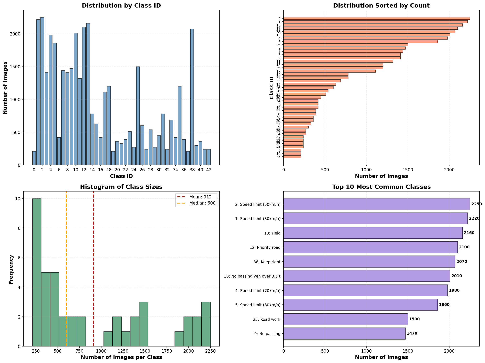
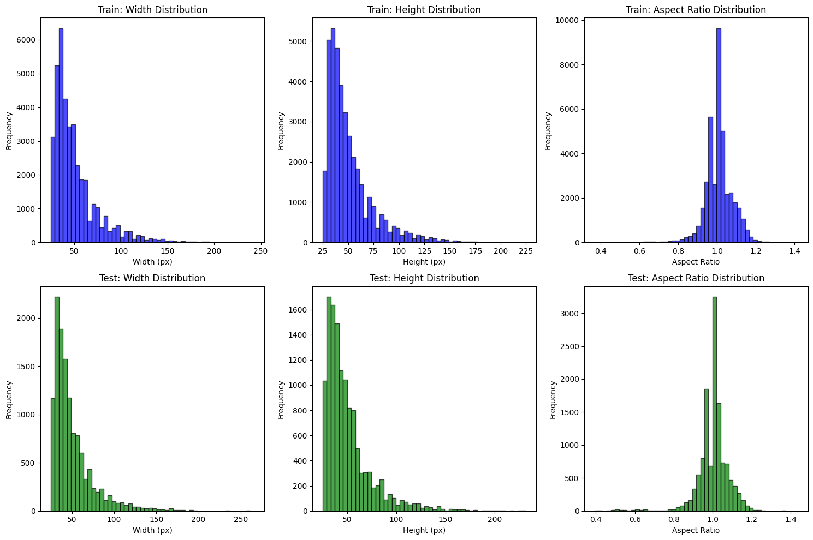
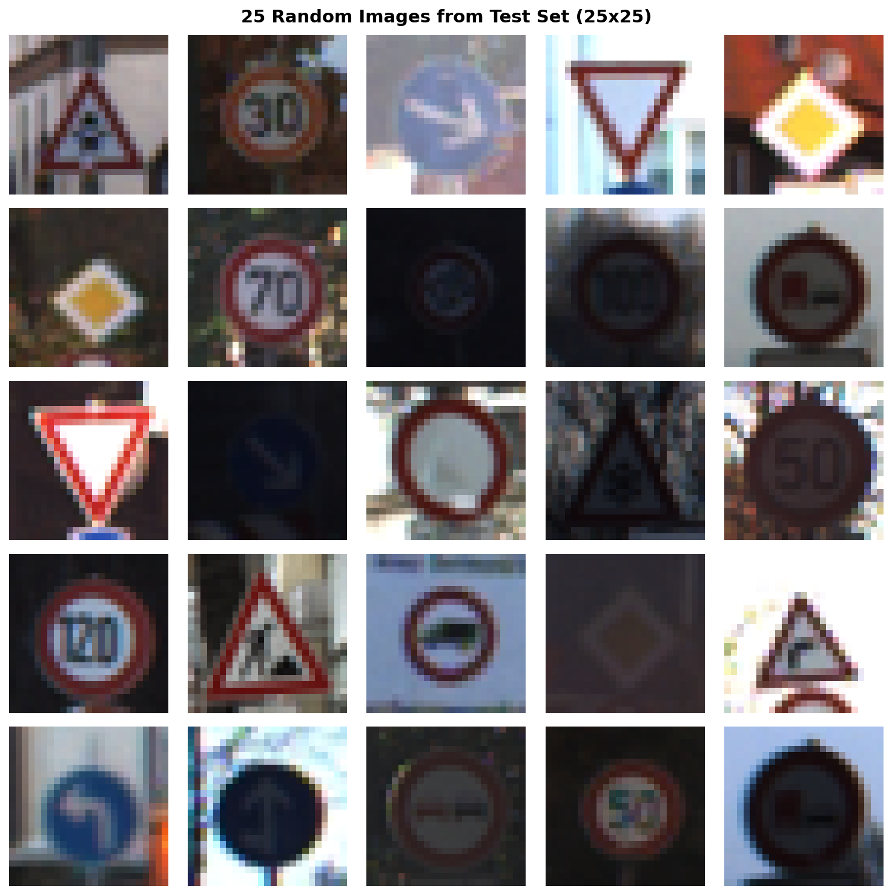
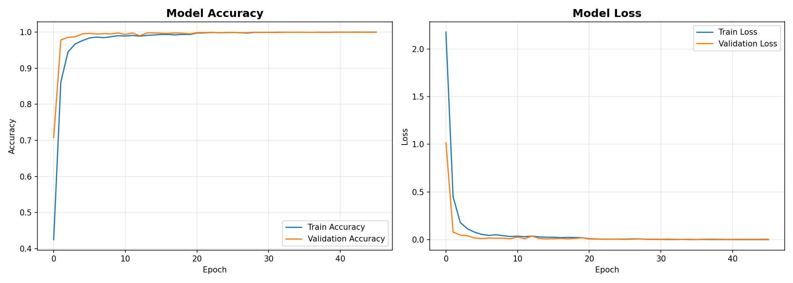

# Traffic sign recognition using GTSRB and CNN
This repository contains a capstone project completed for LM Zoomcamp 2025

## Problem description
Traffic sign recognition and classification is an important problem for self-driving cars as it provides invaluable information for the vehicles to follow the rules and predict possible changes on the road. This projects aims to provide a model that can accurately recognise and classify road signs in over 40 classes. 

### Dataset
GTSRB - German Traffic Sign Recognition Benchmark: www.kaggle.com/datasets/meowmeowmeowmeowmeow/gtsrb-german-traffic-sign
### Analysing the data
As mentioned on the Kaggle page of the dataset, it contains 50k+ images and 43 classes.
* Class analysis:

* Picture size distribution:

* Sampling 25 random images:


## Model training

### Training
Tensorflow and Keras are used for creating a model.
Default parameters:
* learning rate: 0.001
* dropout for the first three convolutional blocks: 0.25
* dropout for the the last layer: 0.5
```python
def create_cnn_model(input_shape=(30, 30, 3), num_classes=43, learning_rate=0.001, drop_first=0.25, drop_second=0.5):
    """
    Create a CNN model for GTSRB traffic sign classification.
    
    This architecture is inspired by successful GTSRB submissions and includes:
    - Multiple convolutional layers for feature extraction
    - Batch normalization for stable training
    - Dropout for regularization
    - Dense layers for classification
    
    Parameters:
    -----------
    input_shape : tuple
        Shape of input images (height, width, channels)
    num_classes : int
        Number of traffic sign classes (43 for GTSRB)
        
    Returns:
    --------
    model : keras.Model
        Compiled CNN model ready for training
    """
    
    model = models.Sequential([
        # Input layer
        layers.Input(shape=input_shape),
        
        # First convolutional block
        layers.Conv2D(32, (3, 3), activation='relu', padding='same'),
        layers.BatchNormalization(),
        layers.Conv2D(32, (3, 3), activation='relu', padding='same'),
        layers.BatchNormalization(),
        layers.MaxPooling2D((2, 2)),
        layers.Dropout(drop_first),
        
        # Second convolutional block
        layers.Conv2D(64, (3, 3), activation='relu', padding='same'),
        layers.BatchNormalization(),
        layers.Conv2D(64, (3, 3), activation='relu', padding='same'),
        layers.BatchNormalization(),
        layers.MaxPooling2D((2, 2)),
        layers.Dropout(drop_first),
        
        # Third convolutional block
        layers.Conv2D(128, (3, 3), activation='relu', padding='same'),
        layers.BatchNormalization(),
        layers.Conv2D(128, (3, 3), activation='relu', padding='same'),
        layers.BatchNormalization(),
        layers.MaxPooling2D((2, 2)),
        layers.Dropout(drop_first),
        
        # Flatten and dense layers
        layers.Flatten(),
        layers.Dense(512, activation='relu'),
        layers.BatchNormalization(),
        layers.Dropout(0.5),
        layers.Dense(256, activation='relu'),
        layers.BatchNormalization(),
        layers.Dropout(drop_second),
        
        # Output layer
        layers.Dense(num_classes, activation='softmax')
    ])
    
    # Compile model
    model.compile(
        optimizer=keras.optimizers.Adam(learning_rate=learning_rate),
        loss='categorical_crossentropy',
        metrics=['accuracy']
    )
    
    return model
```

### Output
The first trained model was saved with the following results:
```python
Epoch 34/50
425/429 ━━━━━━━━━━━━━━━━━━━━ 0s 8ms/step - accuracy: 0.9994 - loss: 0.0019
Epoch 34: val_accuracy improved from 0.99932 to 0.99949, saving model to best_gtsrb_model.h5
```

Though the result was pretty good, I tried to adjust a few parameters to see whether it can be improved further:
* learning rate: [0.0001, 0.001, 0.01, 0.1]
* 1st dropout rate (first three layers): [0, 0.25, 0.5]
* 2nd dropout rate (other layers): [0, 0.25, 0.5]

There was no improvement, so the model was saved with the default parameters.

Running the model on the test dataset:
```python
395/395 ━━━━━━━━━━━━━━━━━━━━ 1s 3ms/step
Test Data accuracy:  98.68566904196358
```

### Challenges
* There seems to be a known bug for older versions of TF + ONNX. Unfortunately, Google Colab does not allow me update further: https://github.com/onnx/tensorflow-onnx/issues/2348. So I used a suggestion from ChatGPT to save the model in the ONNX format.

## Notebook to script
* Running train.py

* Running predict.py


**IMPORTANT:** adjust kaggle_base_path = '/kaggle/input/gtsrb-german-traffic-sign' before running predict.py

## How to reproduce
The model was trained and saved using Google Colab. If you want to reproduce the results, either:
* open the notebook in Google Colab and follow the steps;

OR
* download the dataset from Kaggle using any of the ways provided on the website and adjust the path variable from the following code accordingly:
```python
path = kagglehub.dataset_download("meowmeowmeowmeowmeow/gtsrb-german-traffic-sign")
```
Additionally, check the imports in the notebook.

## Model deployment
### Dependencies

### Containerization

### Cloud deployment

